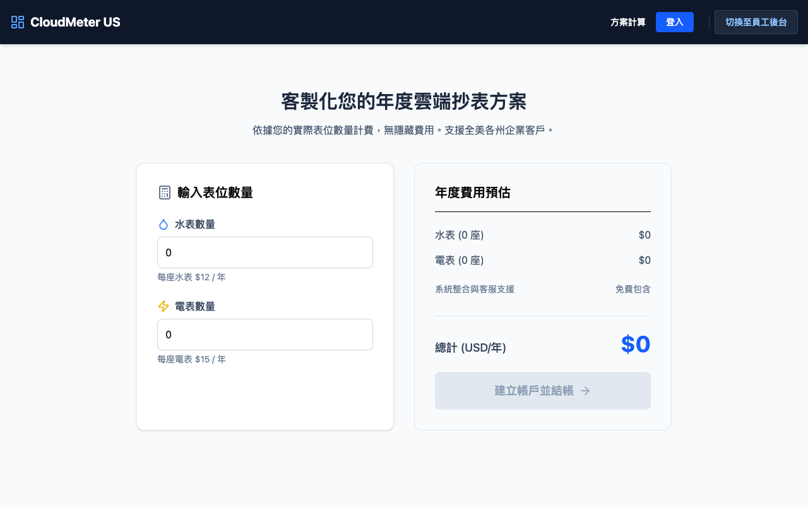
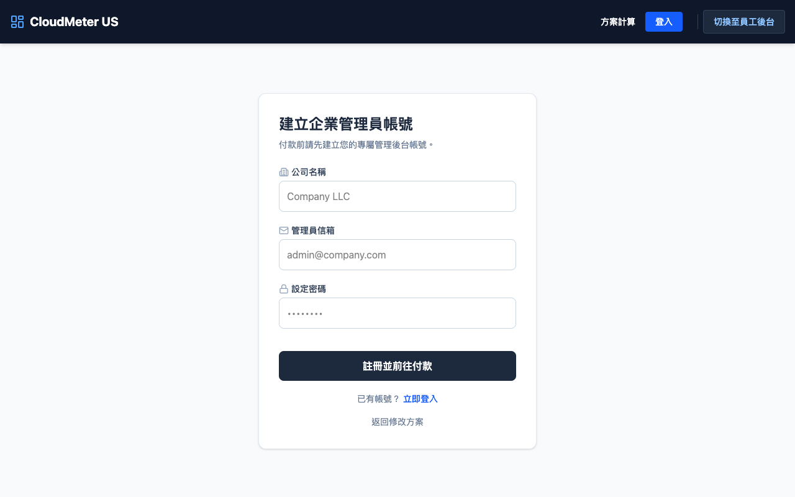
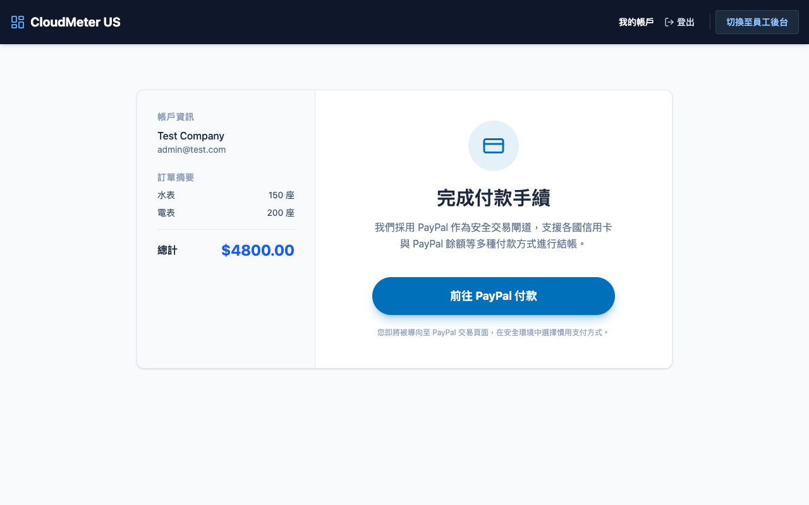
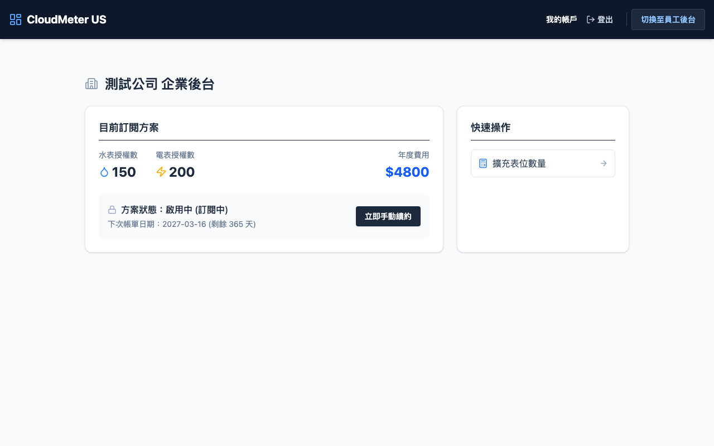
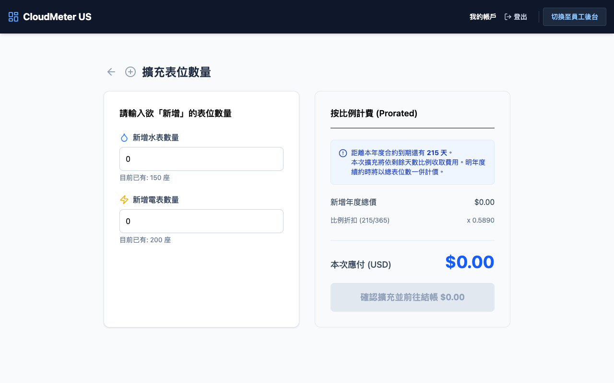
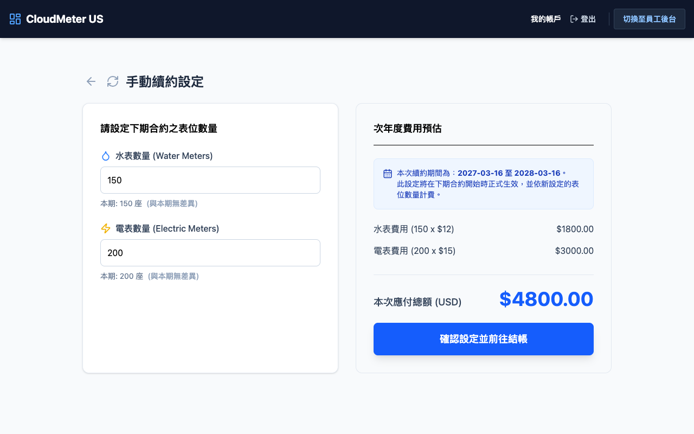
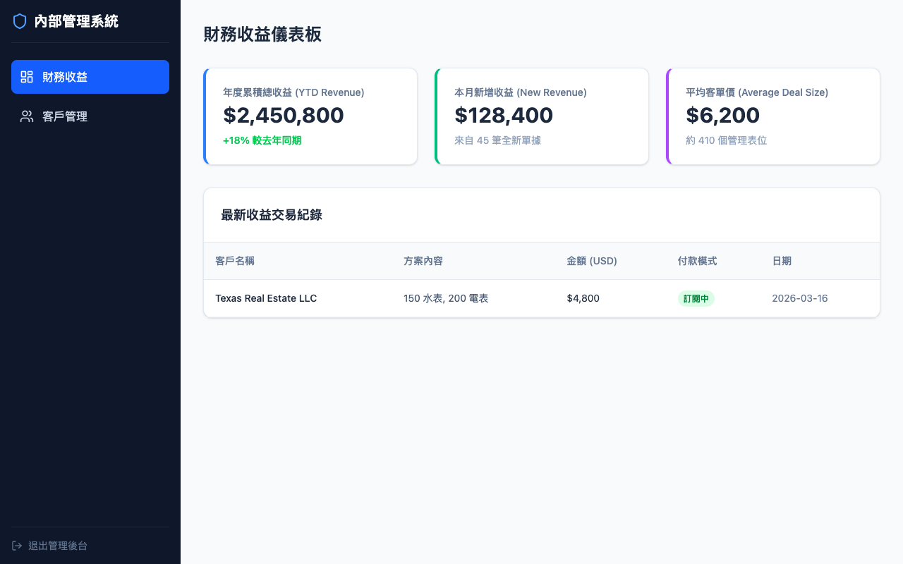

# Cloud Metering 雲端抄表系統操作手冊

本操作手冊將帶領您了解如何使用 Cloud Metering 的各項核心功能。以下依據不同使用者情境，詳細介紹對應的操作流程。

---

## 👨‍💼 客戶端操作情境

### 情境一：新客戶試算與註冊
**情境描述**：身為新客戶，您想了解若導入 Cloud Metering 系統所需花費的年度預算，並註冊專屬帳號。
**操作流程**：
1. **方案計算**：進入系統首頁，在「客製化您的年度雲端抄表方案」區塊，輸入您欲申請的「水表數量」及「電表數量」。
2. **檢視預估**：右側面板將自動即時計算「年度費用預估」，包含單項計費與總計。
3. **建立帳戶**：確認金額後，點擊「建立帳戶並結帳」。

4. **註冊資料**：依序輸入「名稱」、「信箱」以及「設定密碼」，點選「註冊並前往付款」。

### 情境二：完成結帳與開通
**情境描述**：註冊後立即進行繳費，以正式開通雲端管理系統。
**操作流程**：
1. **確認訂單**：在結帳頁面左側核對您的帳戶資訊及訂單摘要（水表與電表數量）。
2. **選擇付款方式**：點擊「前往 PayPal 付款」。

3. **完成支付**：系統將引導您至 PayPal 頁面。您可以選擇登入 PayPal 帳號付款，或是選擇「使用扣帳卡或信用卡付款」以訪客身分進行結帳。輸入必要的表單與安全碼後，提交以支付。
4. **開通成功**：看見「付款成功」提示後，點擊「進入我的管理後台」正式開始使用系統。

### 情境三：日常帳務與狀態管理
**情境描述**：身為客戶，您需要檢視系統授權狀態與過往帳單紀錄。
**操作流程**：
1. **登入系統**：點擊首頁右上方的「登入」，輸入客戶信箱與密碼。
2. **預覽儀表板**：登入後可於上方區塊確認目前訂閱狀態、可用授權數及下次帳單日期。

3. **訂閱與帳單管理**：若需看更詳細資料，可進入相關功能頁面。此處會顯示方案狀態（如啟用中/訂閱中），並列出歷史帳單清單，您可隨時查閱。

### 情境四：擴充表位數量
**情境描述**：公司規模擴大，需要在今年度合約到期前，中途增購水表或電表的雲端授權數。
**操作流程**：
1. **進入擴充功能**：在客戶後台點擊「快速操作」列表中的「擴充表位數量」。
2. **輸入擴充數量**：輸入您欲「新增」的水表或電表數量。

3. **按比例計費**：系統將自動結算距離合約到期的「剩餘天數」，並依比例（Prorated）計算本次應補差額。
4. **結帳生效**：點擊「確認擴充並前往結帳」，付款完成後該擴充授權將立即生效。

### 情境五：明年合約手動續約與數量調整
**情境描述**：今年度即將到期，您希望在明年續約時，根據實際需求增減表位數量。
**操作流程**：
1. **準備續約**：在企業後台的目前訂閱方案區塊中，點擊「立即手動續約」。
2. **設定下期數量**：系統在此會呈現當前使用的數量。請直接修改水表或電表為下期合約期望的總數量。系統會以顏色提示即將增加或減少的差異。

3. **檢視次年費用**：右側將顯示次年度整個週期的費用預估。
4. **確認設定**：點擊「確認設定並前往結帳」以完成手動續約與變更流程，此新設定將在新合約開始時正式生效並依此計費。

---

## 🛠 後台管理操作情境

### 情境六：財務收益與客戶管理
**情境描述**：您是 CloudMeter 後台管理人員，需要檢視系統財務狀態及用戶管理。
**操作流程**：
1. **切換為員工**：於系統右上角導覽列點擊「切換至員工後台」。
2. **財務收益儀表板**：登入後預設進入「財務收益」總覽，查看營收統計。

3. **客戶管理**：在左側選單點擊「客戶管理」，即可查看目前系統上的所有註冊客戶名單與他們的訂閱狀況。
